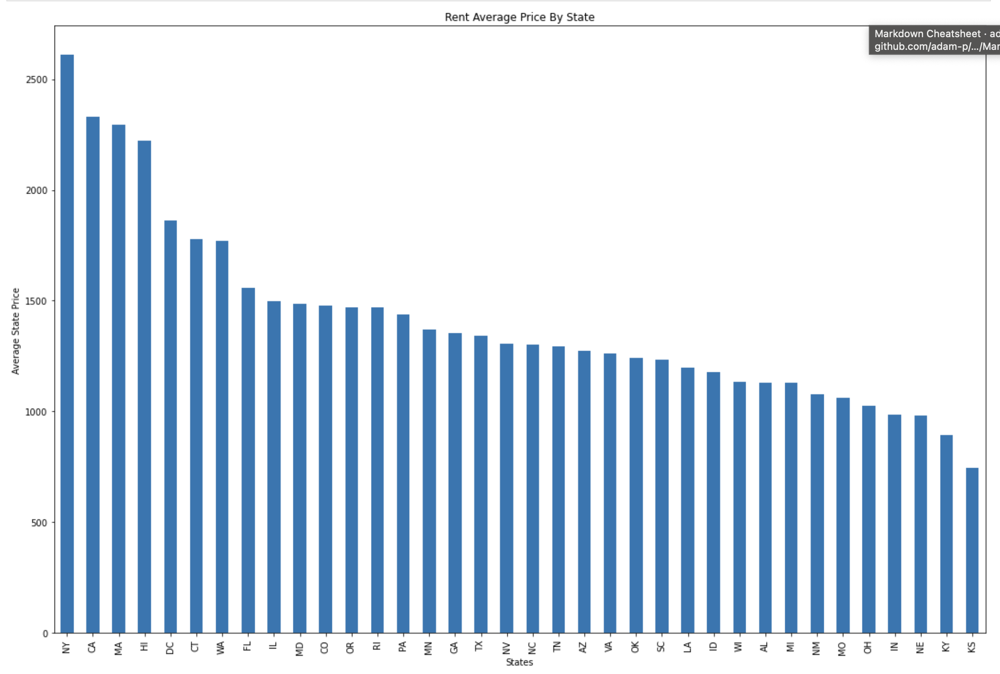
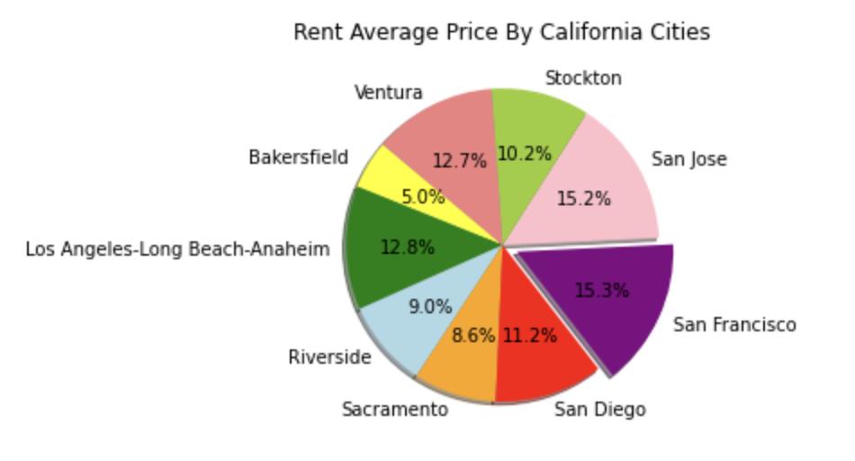
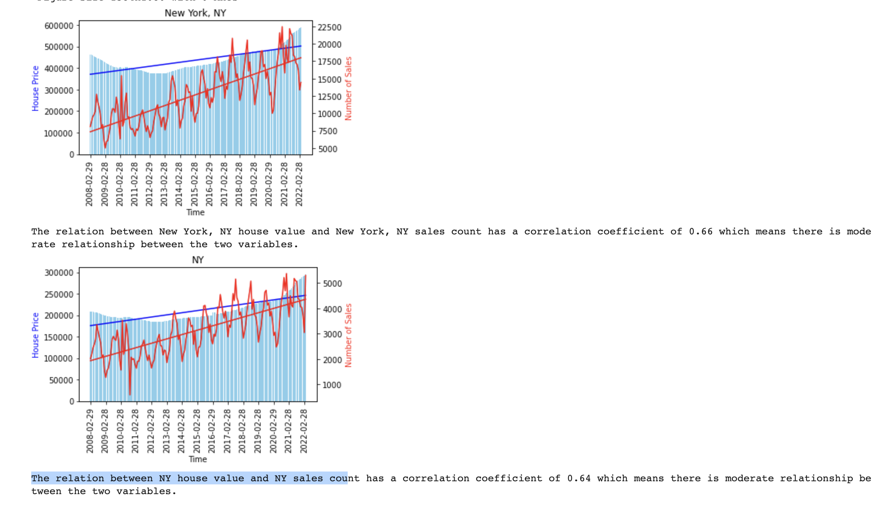

# Housing Home Average Values Analysis in past 20 Years

In this project we are working with the zillow data set and google api for the our obervations and analysis. Home Value prices are significantly increasing with the start of 21st Century, and here we did some analysis within united states Averages of the home values and reant pricing. 

## Data Sets & API

* We used this data set from zillow and downloaded all our CSV's from here [Zillow Research Data Sets](https://www.zillow.com/research/data/).
* We used the google API link [Google API](https://developers.google.com/maps/documentation/geocoding/requests-geocoding)

## Average Home Values By all states in UNITED STATES

 * The following image captures the TOP 5 Average home value by different criterias:

  
  
  
 * Create a Bar graph and boxplot and also the heatmaps to compare all state from 2000 to end of march 2022 base on home value price. It is showing us the Price varies by state and we noticed that Arizona is the cheapeast from all the 50 sates and Hawaii is the most costly. 
  
  
  
  
  
  
  
  
 # Comparision of the Average home in California by past 3 years
 
 * Pie Chart showing the average price of year 2020, 2021 and 2022 in California

  
  
 # Anovotest in Average home value
 * p-value greater than 0.05. If the p-value is large (> 0.05), it indicates weak evidence against the null hypothesis.As a result, the null hypothesis is not rejected.Thus for a hypothesis with a p-value greater than 0.05, the null hypothesis is not rejected, and the alternative hypothesis is not accepted. This means that the results of the research/ study are not statistically significant.
 * p-value less than 0.05. If the p-value is small (< 0.05), it indicates a piece of strong evidence against the null hypothesis. As a result, the null hypothesis is rejected. Thus for a hypothesis with a p-value less than 0.05, the null hypothesis is rejected, and the alternative hypothesis is accepted. This means that the results of the research/ study are statistically significant.

* Based on the TOP 5 STATE VALUE FROM JAN 2000 TO MARCH 2022, does not have any significant IN PRICE.
* F_onewayResult(statistic=122.0636293024792, pvalue=8.814967969996069e-89

* Based on the TOP 2 STATE VALUE FROM JAN 2000 TO MARCH 2022, have significant IN PRICE.
* F_onewayResult(statistic=13.028463629177644, pvalue=0.00033578407607901705

  
  
  

* Based on the TOP 5 CITY IN CALIFORNIA VALUE FROM JAN 2000 TO MARCH 2022, does not have any significant IN PRICE.
* F_onewayResult(statistic=206.69941708214913, pvalue=6.112212677528717e-138)
  
  
  

  
  # Average Rent Values Analysis
  
* The bar chart shows the comparison of rent averages by regions in the United States.
  
  
   
* The scatter plot shows the comparison of rent averages by regions in the United States.
  
  
   
* The bar chart shows the comparison of rent averages by states in the United States.
  
  
  
  
  
  

  
  
  
  # Correllation Test on Sales Count 
  
  
 * In the code, you can pick your desired city to see its home value and sales count relationship but for this graph, we picked New York as the example. The top graph shows only the New York City data while the graph below shows the data of New York State. The bars in blue is home value and the lines in red is sales count. When home value is declining, there is not much of an increase in sales count. However, when home value starts to pick up so does the sales count. In the regression line for both home value and sales count, it has a similar slope. Another important information we can get from the regression line is its importance with home value. When the home value is below the regression line, it means the home value is undervalued. On the other hand, when the home value is above the regression line, it means the home value is overvalued. These ideas apply to the state graph as well. Pearson correlation test is done between home value and sales count and it tells you what the R-value is. In the case of New York, there is a moderate relationship between the two variable with both the city and the state.

    
